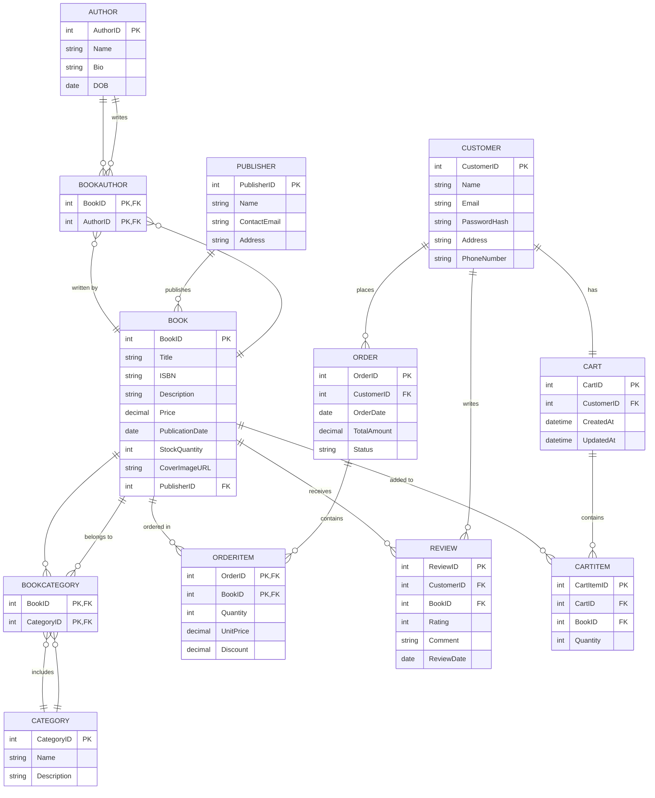

# 📚 Bookstore App – Data Model

## 🧱 Core Entities and Relationships

### 1. **Book**
- **Attributes**:
  - BookID (Primary Key)
  - Title
  - ISBN
  - Description
  - Price
  - PublicationDate
  - StockQuantity
  - CoverImageURL
  - PublisherID (Foreign Key)
- **Relationships**:
  - Belongs to one or more **Categories** (via BookCategory)
  - Written by one or more **Authors** (via BookAuthor)
  - Published by one **Publisher**

---

### 2. **Author**
- **Attributes**:
  - AuthorID (Primary Key)
  - Name
  - Bio
  - DOB
- **Relationships**:
  - Can write many **Books** (via BookAuthor)

---

### 3. **Category**
- **Attributes**:
  - CategoryID (Primary Key)
  - Name
  - Description
- **Relationships**:
  - Can include many **Books** (via BookCategory)

---

### 4. **Publisher**
- **Attributes**:
  - PublisherID (Primary Key)
  - Name
  - ContactEmail
  - Address
- **Relationships**:
  - Can publish many **Books**

---

### 5. **Customer**
- **Attributes**:
  - CustomerID (Primary Key)
  - Name
  - Email
  - PasswordHash
  - Address
  - PhoneNumber
- **Relationships**:
  - Can place many **Orders**

---

### 6. **Order**
- **Attributes**:
  - OrderID (Primary Key)
  - CustomerID (Foreign Key)
  - OrderDate
  - TotalAmount
  - Status (e.g., Pending, Shipped, Completed, Cancelled)
- **Relationships**:
  - Belongs to one **Customer**
  - Contains multiple **OrderItems**

---

### 7. **OrderItem**
- **Attributes**:
  - OrderID (Primary Key, Foreign Key)
  - BookID (Primary Key, Foreign Key)
  - Quantity
  - UnitPrice
  - Discount
- **Relationships**:
  - Linked to one **Order**
  - Linked to one **Book**

---

### 8. **BookAuthor** (Join Table)
- **Attributes**:
  - BookID (Primary Key, Foreign Key)
  - AuthorID (Primary Key, Foreign Key)
- **Relationships**:
  - Links **Book** and **Author** (many-to-many)

---

### 9. **BookCategory** (Join Table)
- **Attributes**:
  - BookID (Primary Key, Foreign Key)
  - CategoryID (Primary Key, Foreign Key)
- **Relationships**:
  - Links **Book** and **Category** (many-to-many)

---

## 🧩 Optional Enhancements

### 10. **Review**
- **Attributes**:
  - ReviewID (Primary Key)
  - CustomerID (Foreign Key)
  - BookID (Foreign Key)
  - Rating (1–5)
  - Comment
  - ReviewDate

---

### 11. **Cart**
- **Attributes**:
  - CartID (Primary Key)
  - CustomerID (Foreign Key)
  - CreatedAt
  - UpdatedAt
- **Relationships**:
  - Contains multiple **CartItems**

### 12. **CartItem**
- **Attributes**:
  - CartItemID (Primary Key)
  - CartID (Foreign Key)
  - BookID (Foreign Key)
  - Quantity

## Entity Relationship Diagram (Mermaid.js)

## Entity Relationship Summary

- **Author ↔ Book** (Many-to-Many via **BookAuthor**)
  - An author can write **many books**
  - A book can be written by **multiple authors**
  - **BookAuthor** join table with composite primary key (BookID, AuthorID)

- **Book ↔ Category** (Many-to-Many via **BookCategory**)
  - A book can belong to **multiple categories**
  - A category can contain **multiple books**
  - **BookCategory** join table with composite primary key (BookID, CategoryID)

- **Book → Publisher** (Many-to-One)
  - A book is published by **one publisher**
  - A publisher can publish **many books**

- **Customer ↔ Order** (One-to-Many)
  - A customer can place **many orders**
  - Each order belongs to **one customer**

- **Order ↔ OrderItem** (One-to-Many)
  - An order contains **multiple order items**
  - Each order item belongs to **one order**
  - **OrderItem** uses a composite primary key (OrderID, BookID)

- **Book ↔ OrderItem** (One-to-Many)
  - A book can appear in **many order items**
  - Each order item references **one book**
  - **OrderItem** uses a composite primary key (OrderID, BookID)

- **Customer ↔ Review** (One-to-Many)
  - A customer can write **many reviews**
  - Each review is written by **one customer**

- **Book ↔ Review** (One-to-Many)
  - A book can have **many reviews**
  - Each review is for **one book**

- **Customer → Cart** (One-to-One)
  - A customer has **one cart**
  - A cart belongs to **one customer**

- **Cart → CartItem** (One-to-Many)
  - A cart contains **multiple cart items**
  - Each cart item belongs to **one cart**

- **CartItem → Book** (Many-to-One)
  - Each cart item references **one book**
  - A book can appear in **many cart items**

This structure provides the foundation for a bookstore e-commerce application while maintaining the relationships between Books, Authors, Publishers, and other key entities. The many-to-many relationships are properly implemented with join tables using composite primary keys. The OrderItem table now follows the Northwind approach with a composite primary key (OrderID, BookID).
